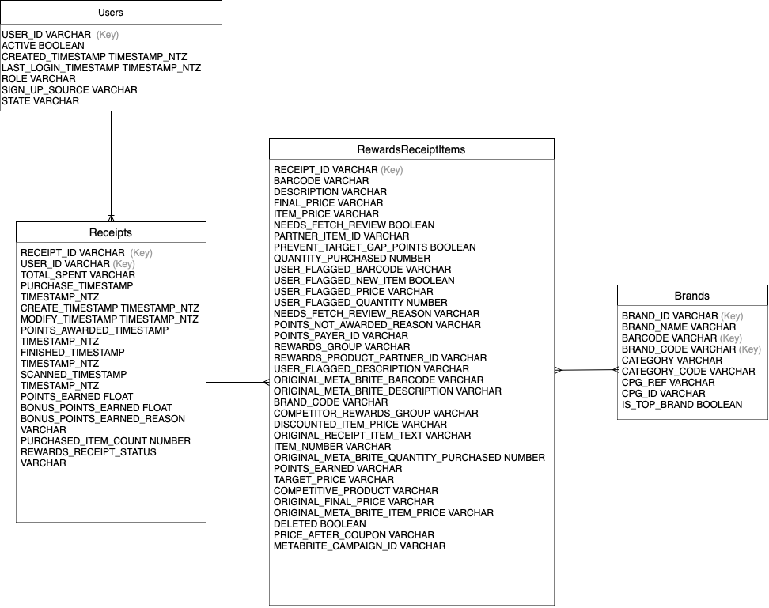

## Review Existing Unstructured Data and Diagram a New Structured Relational Data Model

First of all, I manually inspected the provided raw data by digging into it. Once I understood some of the relationships I made an ERD.


The relationship highlights are:
each receipt belongs to a single user (many-to-one), while receipt items connect to brands through barcodes in a many-to-many relationship. Additionally, one brand can be associated with many receipts through the barcode field in receipt items.

For the project I used DBT for ELT processes to standardize the data and implement business logic for downstream reporting. Snowflake was utilized as the data warehouse for this project, credentials are located under profiles.yml.

## Write Queries That Directly Answer Predetermined Questions from a Business Stakeholder

I have attached the Snowflake SQL queries to the Business Stakeholder questions under the models/reporting.

These queries are meant to be easy to read for business users to logic.

Q: 
Which brand has the most spend among users who were created within the past 6 months?
Which brand has the most transactions among users who were created within the past 6 months?

A:

```sql
{{ config(materialized = 'table') }}

with receipt_metrics as (
    select
        rewards_receipt_status,
        
        -- Handle potential parsing issues with total_spent
        try_cast(total_spent as decimal(18,2)) as parsed_total_spent,
        
        purchased_item_count
    from {{ ref('staging_receipts') }}
    where 
        -- Filter for accepted/rejected receipts
        rewards_receipt_status in ('FINISHED', 'REJECTED')
        
        -- Ensure data quality
        and total_spent is not null
        and purchased_item_count is not null
)

select
    rewards_receipt_status,
    
    -- Average spend metrics
    avg(parsed_total_spent) as avg_total_spent,
    
    -- Count metrics
    sum(purchased_item_count) as total_items_purchased,
    count(*) as receipt_count,
    
    -- Derived metrics
    sum(parsed_total_spent) as total_spent,
    sum(parsed_total_spent) / sum(purchased_item_count) as avg_item_price
from receipt_metrics
group by rewards_receipt_status
order by rewards_receipt_status
```

Q: 
When considering average spend from receipts with 'rewardsReceiptStatus’ of ‘Accepted’ or ‘Rejected’, which is greater?
When considering total number of items purchased from receipts with 'rewardsReceiptStatus’ of ‘Accepted’ or ‘Rejected’, which is greater?

A:

```sql
{{ config(materialized = 'table') }}

select
    b.brand_id,
    b.brand_name,
    count(distinct r.receipt_id) as total_transactions,
    sum(r.total_spent) as total_spent
from {{ ref('staging_users') }} u
inner join {{ ref('staging_receipts') }} r
    on u.user_id = r.user_id
inner join {{ ref('staging_receipt_items') }} ri
    on r.receipt_id = ri.receipt_id
inner join {{ ref('staging_brands') }} b
    on ri.barcode = b.barcode
where 
    u.created_timestamp >= dateadd(month, -6, '2021-03-01 00:00:00.000')
    and b.brand_name is not null
group by 
    b.brand_id,
    b.brand_name
order by 
    total_spent desc,
    total_transactions desc
```

## Data Quality Analysis

After analyzing the data, I identified several key issues that impact the quality and reliability of our insights:

    1. High Rate of Missing Barcodes:
    The majority of scanned receipts are null barcodes (55.48%) within staging_receipt_items which affects the joins between receipt items and brands impacting our ability to join with brand data and provide brand_name matches. Hence, brand analysis is limited as well as the insights we can derive from the data overall. 
    
    ```sql
    with total_counts as (
        select
            count(*) as total_rows
        from raw.public_staging.staging_receipt_items
    ),

    barcode_counts as (
        select
            count(case when barcode is null then 1 end) as null_barcode_count,
            count(case when barcode is not null then 1 end) as non_null_barcode_count
        from raw.public_staging.staging_receipt_items
    )

    select
        -- Bar Code Counts and Percentages
        null_barcode_count,
        non_null_barcode_count,
        round((null_barcode_count * 100.0 / total_rows), 2) as percent_null_barcode,
        round((non_null_barcode_count * 100.0 / total_rows), 2) as percent_non_null_barcode
    from total_counts, barcode_counts;
    ```

    2. Missing User Ids:
    Around 1/3 of the user ids in staging_users are missing in staging_receipts which further limites our scope of synthesizing user metrics.

    ```sql
            with 
            -- Count of distinct user_ids in staging_users
            distinct_users_in_staging_users as (
                select
                    count(distinct user_id) as distinct_user_ids_in_staging_users
                from raw.public_staging.staging_users
            ),

            -- Count of distinct user_ids in users but not in staging_receipts
            distinct_users_not_in_receipts as (
                select
                    count(distinct u.user_id) as distinct_user_ids_not_in_receipts
                from raw.public_staging.staging_users u
                left join raw.public_staging.staging_receipts r
                    on u.user_id = r.user_id
                where r.user_id is null
            )

        -- Combine the results
        select
            distinct_user_ids_in_staging_users,
            distinct_user_ids_not_in_receipts
        from distinct_users_in_staging_users, distinct_users_not_in_receipts;
    ```

    3. Brand Code Strings Unclear:
    Within the brand_code field in staging_brands there are 234 null brand_codes and 35 blank records, furthermore there are many brand codes labeled TEST which may not be ideal in a prod database that should be optimized from clutter .

    ```sql
            select distinct(brand_code) as brand, count(*) as brand_count
            from raw.public_staging.staging_brands
            group by brand
            order by brand_count desc
            ;
    ```
## Communicate with Stakeholders

Hi Team!

I’ve beeing digging into our data regarding users, brands, and receipts, I was able to do intiial work for translating our stakeholders questions into Snowflake tables which should make it easier for the team to pull for reports.

I had some questions regarding the data, and wanted to know who would best be able to answer these:

- There is  test data is for brands_code is in our database and there are many missing values overall in terms of brands records which makes it difficult to reconcile with and contributing to a large amount of items not found.
- Around 55.48% of the scanned receipts are null barcodes, does anyone have any insight into what may be causing this issue. 


Happy to chat further regarding some of the other data concerns I noticed upon my initial review, please feel free to reach out!
